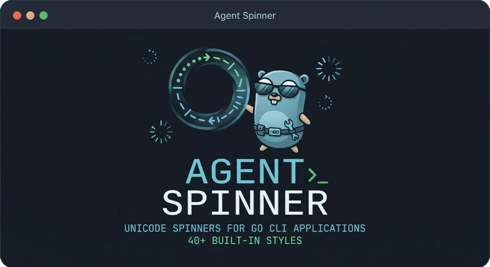

# Agent Spinner

Unicode spinner animations for Go CLI applications. Beautiful, smooth, and highly customizable terminal spinners with 42 built-in styles.



## Features

- 🎨 **42 Built-in Spinners** - From classic braille to modern animations
- ⚡ **Lightweight** - Zero external dependencies
- 🎯 **Thread-Safe** - Concurrent access safe by design
- 🔧 **Customizable** - Create your own spinners easily
- 📦 **Simple API** - Start spinning in 3 lines of code
- 🖥️ **Terminal Aware** - Proper cursor handling and cleanup

## Installation

```bash
go get github.com/benoitpetit/agent-spinner
```

Requires Go 1.21 or later.

## Quick Start

```go
package main

import (
    "time"
    agentspinner "github.com/benoitpetit/agent-spinner"
)

func main() {
    spinner := agentspinner.Start("Loading...")
    time.Sleep(2 * time.Second)
    spinner.Stop("Done!")
}
```

## Usage Examples

### Basic Usage

```go
// Default braille spinner
spinner := agentspinner.Start("Processing...")
spinner.Stop("Complete!")
```

### With Different Styles

```go
// Sci-fi style
spinner := agentspinner.Start("Training AI...", agentspinner.Helix)

// Matrix/cyberpunk style
spinner = agentspinner.Start("Decrypting...", agentspinner.Matrix)

// Progress bar style
spinner = agentspinner.Start("Uploading...", agentspinner.Progress)
```

### Update Message During Operation

```go
spinner := agentspinner.Start("Step 1/3...")
spinner.Update("Step 2/3...")
spinner.Update("Step 3/3...")
spinner.Stop("Finished!")
```

### Error Handling

```go
spinner := agentspinner.Start("Validating...")
// On error:
spinner.Fail("Validation failed!")
```

### Run Helper (Simplified)

```go
// Execute function with automatic spinner
err := agentspinner.Run("Uploading...", func() error {
    // Your work here
    return nil
}, agentspinner.Radar)
```

### Run with Result

```go
result, err := agentspinner.RunWithResult("Computing...", func() (string, error) {
    return "42", nil
}, agentspinner.Star)
```

### Custom Spinner

```go
custom := agentspinner.Spinner{
    Frames:   []string{"◐", "◓", "◑", "◒"},
    Interval: 100, // milliseconds
}
spinner := agentspinner.StartCustom("Loading...", custom)
```

### Signal Handling

```go
// Graceful shutdown on Ctrl+C
spinner := agentspinner.Start("Working...").HandleSignals()
spinner.Stop()
```

### Custom Output with RawRenderer

```go
// Fully control the output format
renderer := agentspinner.NewRawRenderer()
renderer.Output = os.Stdout
renderer.FormatFrame = "\r→ %s %s"     // Custom prefix
renderer.FormatFinal = "\r→ %s %s\n"   // Custom final format

spinner := agentspinner.StartCustom("Processing...",
    agentspinner.NewDefaultRegistry().Get(agentspinner.Dots),
    agentspinner.WithRenderer(renderer),
)
spinner.Stop("Done!")
```

## Available Spinners

### Classic Braille Spinners

| Name | Preview | Description | Interval |
|------|---------|-------------|----------|
| `Braille` | `⠋⠙⠹⠸⠼⠴⠦⠧⠇⠏` | Classic rotating braille (default) | 80ms |
| `BrailleWave` | `⠁⠂⠄⡀ → ⠂⠄⡀⢀ → ...` | Wave pattern across braille cells | 100ms |
| `DNA` | `⠋⠉⠙⠚ → ⠉⠙⠚⠒ → ...` | Double helix DNA animation | 80ms |

### Movement & Scan

| Name | Description | Interval |
|------|-------------|----------|
| `Scan` | Vertical scanner bar moving left to right | 70ms |
| `ScanDual` | Dual vertical scanners converging from edges | 70ms |
| `ScanLine` | Horizontal scanning line moving up and down | 120ms |
| `Cascade` | Diagonal cascading effect | 60ms |
| `FillSweep` | Bottom-to-top fill animation | 100ms |
| `DiagSwipe` | Diagonal wipe transition | 60ms |

### Wave Animations

| Name | Description | Interval |
|------|-------------|----------|
| `Wave` | Horizontal sine wave | 100ms |
| `WaveVertical` | Vertical sine wave | 100ms |
| `WaveRows` | Row-based wave motion | 90ms |
| `Ripple` | Expanding circular ripple | 100ms |

### Geometric Patterns

| Name | Description | Interval |
|------|-------------|----------|
| `Helix` | Double helix spiral | 80ms |
| `Orbit` | Orbiting dot pattern | 100ms |
| `Circle` | Drawing circle animation | 100ms |
| `Diamond` | Expanding diamond shape | 120ms |
| `Cross` | Rotating cross/plus | 80ms |
| `Star` | Four-pointed star rotation | 90ms |
| `Zigzag` | Zigzag pattern | 120ms |

### Progress & Loading

| Name | Description | Interval |
|------|-------------|----------|
| `Progress` | Left-to-right progress bar | 80ms |
| `Loading` | Progressive cell fill animation | 50ms |
| `Bars` | Animated bar chart | 90ms |
| `Columns` | Filling columns sequentially | 60ms |
| `Expand` | Expanding rectangle from center | 80ms |
| `Shrink` | Shrinking rectangle to center | 80ms |
| `RandomFill` | Random cell filling pattern | 60ms |
| `Border` | Border tracing animation | 100ms |

### Modern & Fun

| Name | Description | Interval |
|------|-------------|----------|
| `Matrix` | Matrix-style falling code | 80ms |
| `Pulse` | Pulsing heartbeat effect | 180ms |
| `Radar` | Radar/sonar sweep | 100ms |
| `Typing` | Typing cursor animation | 80ms |
| `Bounce` | Bouncing ball effect | 100ms |
| `PingPong` | Ping pong game simulation | 80ms |
| `Snake` | Snake game-like path | 80ms |

### Decorative

| Name | Description | Interval |
|------|-------------|----------|
| `Sparkle` | Random sparkle pattern | 150ms |
| `Rain` | Matrix-style rain drops | 100ms |
| `Tiles` | Tiling pattern animation | 200ms |
| `Checkerboard` | Alternating checker pattern | 250ms |
| `Breathe` | Breathing effect with expanding dots | 100ms |

### Arrows & Indicators

| Name | Description | Interval |
|------|-------------|----------|
| `Arrow` | Moving arrow pointer | 120ms |
| `Dots` | Animated dot matrix | 120ms |

### Complete List

**Classic:** `Braille`, `BrailleWave`, `DNA`

**Movement:** `Scan`, `ScanDual`, `ScanLine`, `Cascade`, `FillSweep`, `DiagSwipe`

**Wave:** `Wave`, `WaveVertical`, `WaveRows`, `Ripple`

**Geometric:** `Helix`, `Orbit`, `Circle`, `Diamond`, `Cross`, `Star`, `Zigzag`

**Progress:** `Progress`, `Loading`, `Bars`, `Columns`, `Expand`, `Shrink`, `RandomFill`, `Border`

**Modern:** `Matrix`, `Pulse`, `Radar`, `Typing`, `Bounce`, `PingPong`, `Snake`, `Rain`, `Sparkle`

**Decorative:** `Tiles`, `Checkerboard`, `Breathe`

**Indicators:** `Arrow`, `Dots`

## API Reference

### Functions

| Function | Description |
|----------|-------------|
| `Start(message, name?)` | Create and start a spinner with optional style name |
| `StartCustom(message, spinner, opts...)` | Start with custom spinner definition |
| `Run(message, fn, name?)` | Execute function with automatic spinner handling |
| `RunWithResult[T](message, fn, name?)` | Execute function returning a value with spinner |
| `NewDefaultRegistry()` | Get the default spinner registry |
| `NewMutableRegistry()` | Get a mutable registry for custom spinners |

### Renderers

| Function | Description |
|----------|-------------|
| `NewTerminalRenderer()` | Default renderer (stderr, with padding) |
| `NewTerminalRendererWithOutput(w)` | Terminal renderer with custom output |
| `NewRawRenderer()` | Fully configurable renderer (stdout by default) |
| `NewRawRendererWithOutput(w)` | Raw renderer with custom output |
| `NewSilentRenderer()` | No-op renderer (quiet/testing mode) |

### Instance Methods

| Method | Description |
|--------|-------------|
| `Update(message)` | Change the spinner message dynamically |
| `Stop(message?)` | Stop with success symbol (✓) |
| `Fail(message?)` | Stop with error symbol (✗) |
| `HandleSignals()` | Enable graceful shutdown on interrupt signals |

### Types

```go
// Spinner defines an animation sequence
type Spinner struct {
    Frames   []string // Animation frames
    Interval int      // Milliseconds between frames
}

// Name identifies a spinner animation style
type Name string

// State represents the spinner's current state
type State int

const (
    StateRunning State = iota // Spinner is active
    StateStopped              // Completed successfully
    StateFailed               // Stopped with error
)
```

## Advanced Usage

### Custom Registry

```go
reg := agentspinner.NewMutableRegistry()
reg.Register("custom", agentspinner.Spinner{
    Frames:   []string{"▁", "▃", "▄", "▅", "▆", "▇", "█"},
    Interval: 100,
})
```

### With Options

```go
spinner := agentspinner.StartCustom("Loading...", customSpinner,
    agentspinner.WithRenderer(myRenderer),
    agentspinner.WithClock(testClock),
    agentspinner.WithRegistry(customRegistry),
)
```

### RawRenderer Configuration

Use `RawRenderer` for full control over output formatting:

```go
renderer := agentspinner.NewRawRenderer()
renderer.Output = os.Stdout
renderer.FormatFrame = "\r\033[K[%s] %s"   // [frame] message
renderer.FormatFinal = "\r\033[K[%s] %s\n" // [symbol] message + newline
renderer.EnableCursor = true               // Enable cursor hide/show

spinner := agentspinner.StartCustom("Loading...", customSpinner,
    agentspinner.WithRenderer(renderer),
)
```

**RawRenderer Options:**

| Option | Default | Description |
|--------|---------|-------------|
| `Output` | `os.Stdout` | Destination writer |
| `FormatFrame` | `"\r\033[K%s %s"` | Format for frames (%s = frame, message) |
| `FormatFinal` | `"\r\033[K%s\n"` | Format for final output (%s = symbol, message) |
| `EnableCursor` | `true` | Hide/show cursor with ANSI codes |

### Renderer Comparison

| Feature | TerminalRenderer | RawRenderer |
|---------|-----------------|-------------|
| Default output | stderr | stdout |
| Auto padding | 2 spaces | none |
| Custom format | no | yes |
| Cursor control | yes | optional |

## Testing

The package is designed for testability. Use `WithRenderer()` and `WithClock()` to inject mocks:

```go
mockRenderer := &mockRenderer{}
mockClock := &mockClock{}
spinner := agentspinner.StartCustom("Test", s,
    agentspinner.WithRenderer(mockRenderer),
    agentspinner.WithClock(mockClock),
)
```

## Examples

Run the example:

```bash
cd examples/basic
go run main.go
```

## Architecture

The package follows a layered architecture:

- `types.go` - Core types and interfaces (Renderer, Clock, Registry, State)
- `spinner.go` - Runtime with dependency injection support
- `registry.go` - Thread-safe spinner registry with built-in definitions
- `renderer.go` - Terminal, raw, and silent renderer implementations
- `names.go` - Predefined spinner name constants
- `internal/braille` - Grid operations for Braille patterns
- `internal/animations` - Animation generators for complex patterns

## Requirements

- Go 1.21 or later
- Unicode-supporting terminal for best results

## License

MIT License - see [LICENSE](LICENSE) file

## Contributing

Contributions welcome! Feel free to add new spinner animations or improve existing ones.
